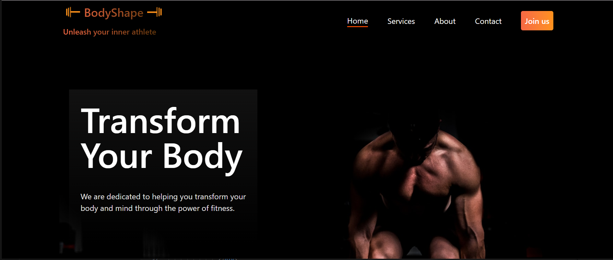

# 🏋️‍♂️ BodyShape Gym Website

A modern and responsive landing page for a fitness and nutrition brand — **BodyShape**.  
Built using **HTML**, **Tailwind CSS**, and **Font Awesome**, this project showcases a clean, professional layout inspired by a Figma design.

---

## 🌐 Live Demo
🔗 [View Live Site](https://cserashed.github.io/bodyshape-assesement)  
*(Add your deployed link here once hosted on GitHub Pages, Netlify, or Vercel)*

---

## 📸 Preview


---

## 🧠 Project Overview
**BodyShape** is a professional landing page designed to motivate users to transform their bodies and minds through fitness.  
The website highlights:
- Fitness programs and nutrition plans  
- Subscription options  
- Professional trainers  
- A visually appealing footer with tags and links  

This project was created as part of a **Tailwind CSS Assessment Task**.

---

## 🛠️ Technologies Used
- **HTML5** – for website structure  
- **Tailwind CSS** – for styling and responsive layout  
- **Font Awesome** – for icons  
- **GitHub** – for version control and code management  

---

## 📱 Features
✅ Fully responsive for all devices (mobile, tablet, and desktop)  
✅ Custom gradient colors and Lucida Sans font  
✅ Modern layout following Figma design guidelines  
✅ Interactive hover effects  
✅ Organized section-based structure (Navbar, Banner, Fitness, Plans, Trainers, Footer)  

---

## 🧩 Sections Overview
1. **Navbar** – Gradient logo, navigation links, and responsive hamburger icon.  
2. **Banner** – Hero section with motivational heading and CTA buttons.  
3. **Fitness & Nutrition** – Cards showing fitness goals and programs.  
4. **Subscription Plans** – Gradient cards with plan pricing and a highlighted recommended plan.  
5. **Trainer Section** – Images of professional gym trainers.  
6. **Footer** – Brand info, company links, contact, tags, and copyright line.  

---

## 🚀 How to Run Locally
1. Clone this repository:
   ```bash
   git clone https://github.com/yourusername/bodyshape.git
